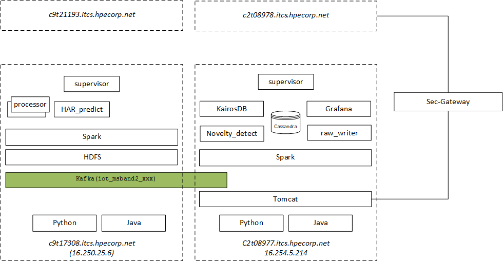

# Code Repository

* All the code is under the github repository. [Page links](../Others/links.md)

## Java
* Java code is under `java/simpleiot2kafka` folder. This has to be opened with Eclipse.
		* Generation of the servlet is done with the export WAR.
		* Name of the servlet has to be `simpleiothttp2kafka.war`

# Installation

## `.bash_profile`
Depends on the system but the root `.bash_profile` should look like that
```
	# .bash_profile

	# Get the aliases and functions
	if [ -f ~/.bashrc ]; then
	        . ~/.bashrc
	fi

	# User specific environment and startup programs
	export JAVA_HOME=/opt/java/jdk1.8.0_72
	export ANT_HOME=/opt/mount1/apache-ant-1.9.4

	export http_proxy="http://web-proxy.austin.hp.com:8080"
	export https_proxy="http://web-proxy.austin.hp.com:8080"
	PATH=$PATH:$HOME/bin
	export PATH=${ANT_HOME}/bin:${JAVA_HOME}/bin:${NODE_HOME}/bin:${PATH}

	export LD_LIBRARY_PATH=/usr/lib64/R/library/rJava/jri
	export PATH=$PATH:/opt/mount1/anaconda2/bin
  export PATH=$PATH:/opt/mount1/hadoop-2.7.3/bin
	export R_HOME=/usr/lib64/R
	export PATH=$PATH:/opt/mount1/spark-1.6.1-bin-hadoop2.6/bin

```

* spark spark (spark-all.sh ? voir avec Chen Gang)
* HDFS install & startup

## Software Stack
System is made of 2 nodes

* Main-Analytic node running the sensor processor and the har predictor
	* python
	* Java
	* Spark
	* HDFS
	* supervisor
* Main-storage node + (the raw_writer, the novelty_detector) + Acquisition-servlet
	* python (+ bayesian module)
	* Java
	* Tomcat
	* Spark
	* kafka (+ kafka-python)
	* cassandra
	* kairosdb
	* Grafana
	* supervisor



Below is presented the installation of each of this module, independently to each other.

## Python (Anaconda2)
### Core
* Retrieve anaconda2  for Linux on `https://www.continuum.io/downloads`
	* `wget https://repo.continuum.io/archive/Anaconda2-4.1.1-Linux-x86_64.sh`
	* `bash Anaconda2-4.1.1-Linux-x86_64.sh`
* as `root` tar xvf anaconda2.tar in `/opt/mount1`
* update the `root` `.bash_profile` file with `export PATH=/opt/mount1/anaconda2/bin:$PATH`
* test
  * as root `python --version`

### specific packages
* for **supervisor** `pip install supervisor`
* for **cassandra**: `pip install cqlsh`
* for **kafka**: `pip install kafka-python`
* for **bayesian**
  * download the zip package from: `wget https://github.com/eBay/bayesian-belief-networks/archive/master.zip`
  * unzip it in a `tmp` directory
  * from here
     * `python setup.py install`
     * `pip install -r requirements.txt`

## Java
* Installation

```
As root

cd /opt/mount1/rta-hc

wget --no-cookies --no-check-certificate --header "Cookie: gpw_e24=http%3A%2F%2Fwww.oracle.com%2F; oraclelicense=accept-securebackup-cookie" "http://download.oracle.com/otn-pub/java/jdk/8u72-b15/jdk-8u72-linux-x64.tar.gz" -e use_proxy=yes

gunzip jdk-8u72-linux-x64.tar.gz

chown –R Hadoop:Hadoop jdk…
```

* Edit the `.bash_profile`
      export JAVA_HOME=/opt/mount1/rta-hc/jdk1.8.0_72
      export PATH=${JAVA_HOME}/bin:$PATH

* Use the following commands to configure java alternatives.
```
As root

alternatives --install /usr/bin/java java $JAVA_HOME/bin/java 2
update-alternatives --install /usr/bin/javac javac $JAVA_HOME/bin/javac 2
alternatives --install /usr/bin/jar jar $JAVA_HOME/bin/jar 2
alternatives --set java $JAVA_HOME/bin/java
alternatives --set javac $JAVA_HOME/bin/javac
alternatives --set jar $JAVA_HOME/bin/jar
```
* check with the `java -version`

## Tomcat
* A servlet is in charge of
	* capturing traffic from the mobile Apps
	* splitting the traffic per sensor
	* push the traffic to individual kafka topics

* **Apache Tomcat installation**
	* `cd /opt/mount1/`
	* download `apache-tomcat-7.0.61.tar` from web
	* `tar xvf apache-tomcat-7.0.61.tar`

* **Apache Tomcat Configuration**
	* Change the defaut HTTP-1 port to 9797
	* edit the `/opt/mount1/apache-tomcat-7.0.61/conf/server.xml`
	* update the line `<Connector port="xxx" protocol="HTTP/1.1"` and set the port to `9797`

* **Tomcat start**
 	* start up tomcat: `apache-tomcat-7.0.61/bin/catalina start`
	* check the `logs/catalina.out` file for any startup error

* **Servlet deployment**
* mv the `simpleiothttp2kafka` servlet to the `webapps` directory
* The `webapps/simpleiothttp2kafka/WEB-INF/web.xml` contains the servlet configuration
* Check the kafka host name (port `9092`) in `web.xml`

## Spark

* **installation**
	* download and tar xvf to `/opt/mount1` the `spark-1.6.1-bin-hadoop2.6`. Available here: http://www-eu.apache.org/dist/spark/spark-1.6.1/spark-1.6.1-bin-hadoop2.6.tgz
	* create the spark-env.sh for reference: `cp conf/spark-env.sh.template spark-env.sh`
	* update the `spark-env.sh`
```
			SPARK_HOME=/opt/mount1/spark-1.6.1-bin-hadoop2.6
			SPARK_MASTER_WEBUI_PORT=1111
			SPARK_MASTER_IP=16.250.25.6
			SPARK_LOCAL_IP=16.250.25.6
			SPARK_WORKER_MEMORY=10g
			HADOOP_CONF_DIR=/opt/mount1/hadoop-2.7.3/etc/hadoop
			PYSPARK_PYTHON=/opt/mount1/anaconda2/bin/python
			PYSPARK_DRIVER_PYTHON=/opt/mount1/anaconda2/bin/python
```

	* update `.bash_profile`

			export PATH=/opt/mount1/spark-1.6.1-bin-hadoop2.6/bin:$PATH
			PATH=$PATH:$HOME/bin

	* create the spark-defaults.conf for reference: `cp conf/spark-defaults.conf.template spark-defaults.conf`
	* update the `spark-defaults.conf`

			spark.master                     spark://16.250.7.135:7077
			spark.driver.memory              512M
			spark.executor.memory            3g

	* update `conf/slaves`
				`host IP@`

* **startup**

	* `/opt/mount1/spark-1.6.1-bin-hadoop2.6`
	* `sbin/start-all.sh`
	* The system may ask you to enter again the root passwd. This will populate the `.ssh/knownhosts`

## Kafka

* **installation**
	* download and tar xvf to `/opt/mount1` the `kafka_2.10-0.9.0.0.tar`. Available here: http://www-eu.apache.org/dist/kafka/0.9.0.0/kafka_2.10-0.9.0.0.tgz
	* create the kafka and zookeeper logs directory
```
			cd /opt/mount1
			mkdir kafka-logs
			mkdir zookeeper-logs
```
	* update `config/zookeeper.properties`
			dataDir=/opt/mount1/zookeeper-logs
	* update `config/server.properties`
			log.dirs=/opt/mount1/kafka-logs
			delete.topic.enable=true

* **starup**
	* `bin/zookeeper-server-start.sh config/zookeeper.properties &`
	* `bin/kafka-server-start.sh config/server.properties &`

* **config**
Need to create and configure the different kafka topics
```
bin/kafka-topics.sh --create --zookeeper localhost:2181 --partitions 1 --replication-factor 1 --topic iot_har_novelty_detect
bin/kafka-topics.sh --create --zookeeper localhost:2181 --partitions 1 --replication-factor 1 --topic iot_har_predict_aggr
bin/kafka-topics.sh --create --zookeeper localhost:2181 --partitions 1 --replication-factor 1 --topic iot_processor_ctrl
bin/kafka-topics.sh --create --zookeeper localhost:2181 --partitions 1 --replication-factor 1 --topic iot_msband2_accel
bin/kafka-topics.sh --create --zookeeper localhost:2181 --partitions 1 --replication-factor 1 --topic iot_msband2_ambientLight
bin/kafka-topics.sh --create --zookeeper localhost:2181 --partitions 1 --replication-factor 1 --topic iot_msband2_barometer
bin/kafka-topics.sh --create --zookeeper localhost:2181 --partitions 1 --replication-factor 1 --topic iot_msband2_calorie
bin/kafka-topics.sh --create --zookeeper localhost:2181 --partitions 1 --replication-factor 1 --topic iot_msband2_contact
bin/kafka-topics.sh --create --zookeeper localhost:2181 --partitions 1 --replication-factor 1 --topic iot_msband2_distance
bin/kafka-topics.sh --create --zookeeper localhost:2181 --partitions 1 --replication-factor 1 --topic iot_msband2_gsr
bin/kafka-topics.sh --create --zookeeper localhost:2181 --partitions 1 --replication-factor 1 --topic iot_msband2_gyroscope
bin/kafka-topics.sh --create --zookeeper localhost:2181 --partitions 1 --replication-factor 1 --topic iot_msband2_hdhld
bin/kafka-topics.sh --create --zookeeper localhost:2181 --partitions 1 --replication-factor 1 --topic iot_msband2_heartRate
bin/kafka-topics.sh --create --zookeeper localhost:2181 --partitions 1 --replication-factor 1 --topic iot_msband2_pedometer
bin/kafka-topics.sh --create --zookeeper localhost:2181 --partitions 1 --replication-factor 1 --topic iot_msband2_rrInterval
bin/kafka-topics.sh --create --zookeeper localhost:2181 --partitions 1 --replication-factor 1 --topic iot_msband2_skinTemperature
bin/kafka-topics.sh --create --zookeeper localhost:2181 --partitions 1 --replication-factor 1 --topic iot_msband2_uv
```

## HDFS

HDFS is required because we are running spark randomForest models that need to be loaded from HDFS.
No way with Spark Mlib to load model from the flat File System.

**HDFS installation**

* Reference doc is: https://hadoop.apache.org/docs/r2.7.2/hadoop-project-dist/hadoop-common/SingleCluster.html
* `wget http://www-eu.apache.org/dist/hadoop/common/hadoop-2.7.3/hadoop-2.7.3.tar.gz`
* Installation directory is `/opt/mount1/hadoop-2.7.3`
* untar as `root`
* in `etc/hadoop/hadoop-env.sh` I've set `export JAVA_HOME=/opt/java/jdk1.8.0_72`
* Used the "pseudo-distributed version"
* `etc/hadoop/core-site.xml`
```
<configuration>
    <property>
        <name>fs.defaultFS</name>
        <value>hdfs://localhost:9000</value>
    </property>
</configuration>
```
* `etc/hadoop/hdfs-site.xml`
```
<configuration>
    <property>
        <name>dfs.replication</name>
        <value>1</value>
    </property>
    <property>
         <name>dfs.namenode.name.dir</name>
         <value>/opt/mount1/hadoop-2.7.3/data-dir</value>
         <description>Comma-separated list of paths. Use the list of directories from $DFS_NAME_DIR. </description>
    </property>
    <property>
         <name>dfs.datanode.data.dir</name>
         <value>/opt/mount1/hadoop-2.7.3/name-dir</value>
         <description>Comma-separated list of paths. Use the list of directories from $DFS_DATA_DIR. .</description>
    </property>
</configuration>
```

* Format the hdfs Storage: `bin/hdfs namenode -format`

* update root `.bash_profile`:
	* `PATH=$PATH:$HOME/bin:/opt/mount1/hadoop-2.7.3/bin`
* Start the cluster: `sbin/start-dfs.sh`.
* Check that all is OK in `logs` directory. Should have 1 file for datanode and 1 for namenode
* check
	* `ps ef | grep namenode`
	* `ps ef | grep datanode`
	* `hadoop fs -ls /`


## Cassandra
### Installation
* as `root` Add the DataStax Community repository to the `/etc/yum.repos.d/datastax.repo` as follow
```
      [datastax]
      name = DataStax Repo for Apache Cassandra
      baseurl = http://rpm.datastax.com/community
      enabled = 1
      gpgcheck = 0
```
* Install the packages as following.
```
      yum install dsc22
      yum install cassandra22-tools
```

* Create below folders according to settings in `cassandra.yaml`, and grant necessary privileges to these folders.
```
       cd /opt/mount1
       [root@c2t08977 cassandra]# mkdir cassandra
       [root@c2t08977 cassandra]# cd cassandra
       [root@c2t08977 cassandra]# mkdir commitlog
       [root@c2t08977 cassandra]# mkdir data
       [root@c2t08977 cassandra]# mkdir log
       [root@c2t08977 cassandra]# mkdir saved_caches
       [root@c2t08977 cassandra]# cd ..

       chown –R cassandra:root cassandra

      ll cassandra/
       total 16
       drwxr-xr-x 2 cassandra root 4096 Mar 18 03:43 commitlog
       drwxr-xr-x 2 cassandra root 4096 Mar 18 03:39 data
       drwxr-xr-x 2 cassandra root 4096 Mar 18 03:39 log
       drwxr-xr-x 2 cassandra root 4096 Mar 18 03:43 saved_caches
       [hadoop@c9t21193 mount1]$ pwd
       /opt/mount1
```


* configure `/etc/cassandra/conf/cassandra.yaml`

```
      cluster_name: rpm_cassandra_iot
      data_file_directories: [/opt/mount1/cassandra/data]
      saved_caches_directory: /opt/mount1/cassandra/saved_caches
      commitlog_directory: /opt/mount1/cassandra/commitlog
      seed_provider:
          # Addresses of hosts that are deemed contact points.
          # Cassandra nodes use this list of hosts to find each other and learn
          # the topology of the ring.  You must change this if you are running
          # multiple nodes!
          - class_name: org.apache.cassandra.locator.SimpleSeedProvider
            parameters:
                # seeds is actually a comma-delimited list of addresses.
                # Ex: "<ip1>,<ip2>,<ip3>"
                - seeds: "127.0.0.1,16.250.7.135"
      listen_address: c9t21193.itcs.hpecorp.net
      rpc_address: c9t21193.itcs.hpecorp.net
```

* update the `./default.conf/logback.xml`  (Lines 36 & 54)
```
       <file>/opt/mount1/cassandra/log/system.log</file>
       <file>/opt/mount1/cassandra/log/debug.log</file>
```


* start cassandra for testing
	 * by invoking `bin/cassandra -f &` or `cassandra &` from the command line. The service should start in the foreground and log gratuitously to the console. Assuming you don't see messages with scary words like "error", or "fatal", or anything that looks like a Java stack trace, then everything should be working.
	 * Press `Control-C` to stop Cassandra (in case not using &)

### Create keyspace & tables

The source file to use for creating the key_space and tables is available under `conf` directory
To export keyspace schema: `cqlsh c2t08977.itcs.hpecorp.net -e "DESC KEYSPACE iot_hc" > iot_hc_schema.cql`

To import schema open terminal

```
			open cqlsh shell
			source 'iot_hc_schema.cql'
```


To export entire database schema:
cqlsh c2t08977.itcs.hpecorp.net -e "DESC SCHEMA" > db_schema.cql

## KairosDB
### install config run
* download & isntall
```
		wget https://github.com/kairosdb/kairosdb/releases/download/v1.1.1/kairosdb-1.1.1-1.tar.gz
		cd /opt/mount1
		gunzip kairosdb-1.1.1-1.tar.gz
		tar xvf kairosdb-1.1.1-1.tar.gz
		vi kairosdb/conf/kairosdb.properties
		  change kairosdb.jetty.port from 8080 --> 9090
		bin/kairosdb.sh start
		tail -f log/kairosdb.log
		bin/kairosdb.sh stop
```

* stop cassandra
```
		ps -ef | grep cassandra
		kill pid  
```
* configure cassandra
			/etc/cassandra/default.conf/cassandra.yaml
```
			start_rpc: true
			rpc_address: localhost or the hostname
			rpc_port: 9160
```
* start cassandra
		`cassandra`

* configure
```
			/opt/mount1/kairosdb/conf/kairosdb.properties
			#kairosdb.service.datastore=org.kairosdb.datastore.h2.H2Module
			kairosdb.datastore.concurrentQueryThreads=5
			kairosdb.service.datastore=org.kairosdb.datastore.cassandra.CassandraModule
			kairosdb.datastore.cassandra.host_list=c4t19765.itcs.hpecorp.net:9160
			kairosdb.datastore.cassandra.keyspace=iot_hc_grafana
```

**Important to set a non existing keyspace such as kairosdb create the one it needs**

* start again kairosDb
```
	   service kairosdb stop (rpm install)
	   bin/kairosdb.sh start (tar install)
```
### Sanity check
* POST a new Data point
```
POST http://c4t19765.itcs.hpecorp.net:9090/api/v1/datapoints
	[{"name":"accelerometer-x","timestamp":1458632210606,"value":"0.991211","tags":{"deviceid":"b81e905908354542","userid":"vincent.planat@hpe.com"}},{"name":"accelerometer-y","timestamp":1458632210606,"value":"-0.027588","tags":{"deviceid":"b81e905908354542","userid":"vincent.planat@hpe.com"}},{"name":"accelerometer-z","timestamp":1458632210606,"value":"0.015625","tags":{"deviceid":"b81e905908354542","userid":"vincent.planat@hpe.com"}}]
```

* Check is data point was created
```
POST http://c2t08978.itcs.hpecorp.net:9090/api/v1/datapoints/query
{
   "start_absolute": 1463551612572,
   "metrics": [
       {
           "name": "har_prediction",
           "limit": 1000
       }
   ]
}
```

* DELETE Metric
		DELETE http://c4t19765.itcs.hpecorp.net:8080/api/v1/metric/accelerometer

* Retrieve Tag Names
		http://c4t19765.itcs.hpecorp.net:8080/api/v1/tagnames

* Retrieve Metric Names
		http://c4t19765.itcs.hpecorp.net:8080/api/v1/metricnames


## Grafana

### Install-config-run

* install the package
```
		yum install https://grafanarel.s3.amazonaws.com/builds/grafana-3.0.1-1.x86_64.rpm
		sudo service grafana-server start
```
* install the KairosDB plugin
```
		cd /opt/mount1/rta-hc
		  wget https://github.com/grafana/kairosdb-datasource/archive/master.zip
		  unzip master.zip
		  should arrive to a plugin installed in /opt/mount1/rta-hc/kairosdb-datasource-master
		  edit /etc/grafana/grafana.ini
		  append at the end
		  [plugin.kairosdb]
		  path = /opt/mount1/rta-hc/kairosdb-datasource-master
```
* start
		`sudo service grafana-server restart`

### Sanity Check
```
		http://c4t19765.itcs.hpecorp.net:3000/
			admin/admin
			Add a data source kairosDB
		               Type: KairsDB
		               Url: http://c9t17308.itcs.hpecorp.net:9090
		               access:proxy
```

## platform monitor

The objective of the platform monitor is to provide to the admin of the platform capabilities to
* start/stop the different processes
* list their respective status
* Access the log files (only for the processor files)

The platform monitor provides 2 interfaces
* A command line interface
* A web interface

The command line interface allows to start/stop/monitor processes status, where the web console is limited to status monitor and process log (in a `tail -f` mode) access.

### scipts & config files

* The platform monitoring package is made of 3 python scripts

| Script                    | Comment       |
| -------------             |-------------|
| src/platform_mngt_cli.py      |command line interface  								|
| src/platform_status_mon.py    |web interface     |
| src/platform_mngt_cli_lib.py  |specific libraries required by the monitoring toolss |  

* The platform monitoring package is relying on different configuration files

| Files                     | Comment       |
|-------------              |-------------|
|conf/rta.properties        |provides the mapping between hostnames and monitoring profiles   |
|conf/rta_constants.py      |define a constant used by the platform monitoring package        |
|conf/<procs_profile>.properties  |contains the definition of the profile. One file per profile     |

### configuration files
* properties file: `rta.properties`
	* The `[platform_mon]` section lists the hosts that can run the platform monitor. This list is formatted as a JSON
		* `hosts_list` - the server name mapping the profile
		* `procs_profile` - the profile name. This name must map a file name in the `conf` directory following the naming convention: `<procs_profile>.properties`

```
[platform_mon]
hosts_list = {"hosts_list":[{"hostname":"c9t17308.itcs.hpecorp.net","procs_profile":"main-analytic"},{"hostname":"c9t21193.itcs.hpecorp.net","procs_profile":"main-analytic"},{"hostname":"c2t08977.itcs.hpecorp.net","procs_profile":"main-storage"},{"hostname":"c2t08978.itcs.hpecorp.net","procs_profile":"main-storage"}]}
```

current we have mapping list as here

| Hosts_list                    | profile       |
| -------------             |-------------|
| c9t17308.itcs.hpecorp.net      |main-analytic |
| c9t21193.itcs.hpecorp.net  |main-analytic     |
| c2t08977.itcs.hpecorp.net    |main-storage       |
| c2t08978.itcs.hpecorp.net| main-storage      |  


* properties file: `<procs_profile>.properties`
	* We have as many `<procs_profile>.properties` as we have `procs_profile` defined into the `rta.properties`
	* The content of the file is a JSON object. This object list all the process that this profile is attached to.
	* For each process it provides informations about how to identify this process into the process list returned by the `ps` command.
		* `zookeeper` - you are checking processor name
		* `list[0] - option 0|1`
			* 0 - will not checking processer is running or not
			* 1 - will checking processor is running or not
		* `list[1...n]` - regular expression of process,normally linux grep process information as list. 'index' is index of processor information. 'regex' is regular expression of processor information

```
{'zookeeper':[0,{'index':0,'regex':'java'},
                {'index':22,'regex':'config/zookeeper.properties'},
                {'index':21, 'regex':'org.apache.zookeeper.server'}],
'kafka':[0,{'index':21, 'regex':'org.apache.zookeeper.server'},
            {'index':22, 'regex':'config/server.properties'},
            {'index':21, 'regex':'kafka.Kafka'}],
'spark':[1,{'index':5, 'regex':'org.apache.spark.deploy.master.Master'}],
'spark':[1,{'index':5, 'regex':'org.apache.spark.deploy.worker.Worker'}],
'accl_processor':[0,{'index':0, 'regex':'java'},
                    {'index':18, 'regex':'sklearn'},
                    {'index':17, 'regex':'accelerometer'},
                    {'index':16, 'regex':'rta_processor_simple.py'}],
'gyro_processor':[0,{'index':0, 'regex':'java'},
                    {'index':18, 'regex':'sklearn'},
                    {'index':17, 'regex':'gyroscope'},
                    {'index':16, 'regex':'rta_processor_simple.py'}],
'baro_processor':[0,{'index':0, 'regex':'java'},
                    {'index':18, 'regex':'sklearn'},
                    {'index':17, 'regex':'barometer'},
                    {'index':16, 'regex':'rta_processor_simple.py'}],
'aggr_processor':[0,{'index':0, 'regex':'java'},
                    {'index':17, 'regex':'naivebayes'},
                    {'index':16, 'regex':'har_predict_aggr_ensemble.py'}],
'cassandra':[1,{'index':0, 'regex':'java'},
                {'index':47, 'regex':'org.apache.cassandra.service.CassandraDaemon'}],
'kairosDb':[1,{'index':0, 'regex':'java'},
              {'index':5, 'regex':'org.kairosdb.core.Main'}],
'grafana':[1,{'index':0, 'regex':'grafana-server'}],
'tomcat':[1,{'index':0, 'regex':'java'},
            {'index':9, 'regex':'org.apache.catalina.startup.Bootstrap'}],
'novelty':[1,{'index':0, 'regex':'java'},
             {'index':16, 'regex':'novelty_detect.py'}],
'raw_writer':[1,{'index':0, 'regex':'java'},
                {'index':16, 'regex':'raw_writer.py'}]
}
```

### Installation

Installation

### Monitoring Startup
 - CMD monitoring

    - run RTA cmd via [root@c2t08978 src]# python platform_mngt_cli.py
    - list all the processor status via rta&gt;&gt; list
    - search all the available command via rta&gt;&gt; ?
    - see help of command via rta&gt;&gt; help start
    - start processor by this way rta&gt;&gt; start cassandra
    - stop processor by this way rta&gt;&gt; stop cassandra


 - Web monitoring
    - start web server via [root@c2t08978 src]# python platform_status_mon.py
    - open browser http://your server name:5000/result


---------------------------------------------

## supervisor

### Installation
* This component is used to monitor the running Spark job. We could have used the spark management console, but supervisor
expose a very simple interface to start/stop and tail-f logs.

* A `wrapper.py` is available in the `src` directory for encapsulating the startup of the spark jobs.

* To install supervisor: `pip install supervisor`

### Configuration
* From the solution `conf` directory copy the `supervisord.conf.template` to `supervisor.conf`
* `cp <SOLUTION_PATH>/conf/supervisord.conf.tempplate /etc/supervisord.conf`
* Update the path, according to your <SOLUTION_PATH>. The below example is for the Main-Analytic server

			[supervisord]
			logfile=/opt/mount1/rta-hc/integration/rta-hc-framework-master/log/supervisord.log ; (main log file;default $CWD/supervisord.log)
			....

			[program:rta_processor_accel]
			command=python /opt/mount1/rta-hc/integration/rta-hc-framework-master/src/rta_wrapper.py -sh "/opt/mount1/rta-hc/integration/rta-hc-framework-master" -sn "rta_processor_simple.py accelerometer" -e "2G"                                      ; the program (relative uses PATH, can take args)
			stdout_logfile=/opt/mount1/rta-hc/integration/rta-hc-framework-master/log/rta_processor_accel.log
			stderr_logfile=/opt/mount1/rta-hc/integration/rta-hc-framework-master/log/rta_processor_accel.log

			[program:rta_processor_gyro]
			....

			[program:rta_processor_distance]
			....

			[program:har_prediction_aggr]
			....

### Startup
* start: `supervisord -n &`
