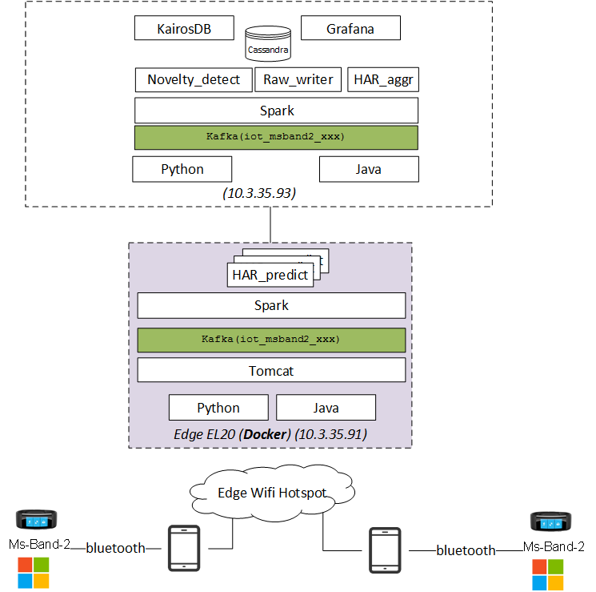

#  systems map

|           |    Main Analytic  |    Main Storage  | Edge Server  |
|-----------|-------------------|------------------|--------------|
|    ITG    |    10.3.35.92     |    10.3.35.93    |  10.3.35.91  |

Access with F5 VPN: [lien](https://213.30.160.100/)

# System monitoring table

|    Function       |    Port    |   Comments                                   |
|-------------------|------------|----------------------------------------------|
| kafka prod        |    9192    |                                              |
| kafka cons        |    2181    |    listen on 0.0.0.0                         |
| Spark             |    7077    |    port mapping external                     |
|                   |    1111    |    port mapping external                     |
| tomcat monitor    |    9797    |    port mapping external http://c2t08977.itcs.hpecorp.net:9797/simpleiothttp2kafka/rta_msband_mon    |
| KairosDB          |    9090    |    port mapping external                     |
| Grafana           |    3000    |    port mapping external                     |

# User/ passwd
* all 3 linux system `root/smwatch2HPESC`
