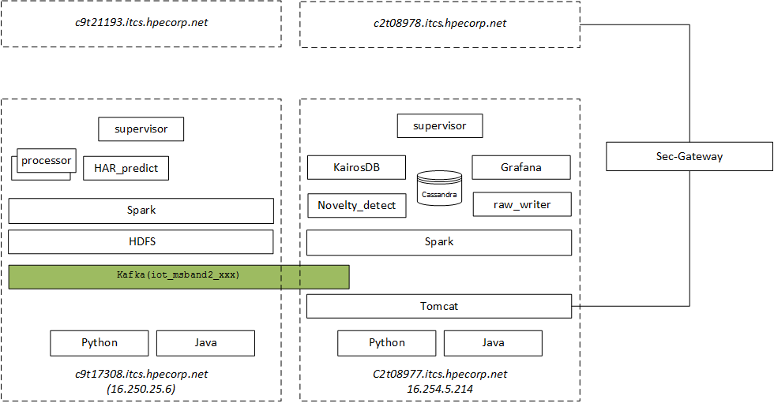

#  systems map

|           |    Main Analytic                 |    Main Storage                 |
|-----------|----------------------------------|---------------------------------|
|    ITG    |    c9t17308.itcs.hpecorp.net     |    C2t08977.itcs.hpecorp.net    |
|    DEV    |    C9t21193.itcs.hpecorp.net     |    C2t08978.itcs.hpecorp.net    |

* ``c2t0897x`` sont des VMs de Vincent-R de ``SGW HPE DEV - ServicePlatform``
* ``c9txxxxx`` sont des VMs de Antonio



# User/ passwd
* **Grafana**: admin/admin
* **supervisor**: admin/admin
* ``c9txxxxx`` : ``hadoop``/ old(`Rta_2016`) new (`Rpmhc_16!.`)
* ``c2t0897x`` : HP-domain-user/passwd
* mobile-apps: NT email/passwd

# Kafka topics
```
    iot_har_novelty_detect
    iot_har_predict_aggr
    iot_msband2_accel
    iot_msband2_ambientLight
    iot_msband2_barometer
    iot_msband2_calorie
    iot_msband2_contact
    iot_msband2_distance
    iot_msband2_gsr
    iot_msband2_gyroscope
    iot_msband2_hdhld
    iot_msband2_heartRate
    iot_msband2_pedometer
    iot_msband2_rrInterval
    iot_msband2_skinTemperature
    iot_msband2_uv
    iot_processor_ctrl
```

# Urls & ports

## Security Gateway
Console management: https://api-stg-sgw.ext.hpe.com/gw/sp/mngt/hp-security-gateway-management/

| Urn                                      | Links                                                                   |
|------------------------------------------|-------------------------------------------------------------------------|
| urn:hpe:iot:rt-analytics:ms-band.stg:1.0 | http://c2t08977.itcs.hpecorp.net:9797/simpleiothttp2kafka/raw_msband_v2 |

## ITG Environment

### Demo Dashboard

| Service                                      | Link                                                                                                                                                                                    |
|----------------------------------------------|-----------------------------------------------------------------------------------------------------------------------------------------------------------------------------------------|
| (Grafana) Dashboard                          | (internal) http://c2t08977.itcs.hpecorp.net:3000/ <br> (external) https://api-prx-stg-sgw.itcs.hpe.com/?X-GW-WEBPROXY-TARGET=grafana                                                    |
| Acquisition monitoring page (admin/admin)    | (internal) http://c2t08977.itcs.hpecorp.net:9797/simpleiothttp2kafka/rta_msband_mon <br> (external) https://api-stg-sgw.ext.hpe.com/gw/iot/rt-analytics/ms-band-base.stg/rta_msband_mon |
| Supervisor System-1 (admin/admin)            | (internal) http://c9t17308.itcs.hpecorp.net:9001/<br>  (external) https://api-prx-stg-sgw.itcs.hpe.com/?X-GW-WEBPROXY-TARGET=iot-supervisor-1                                           |
| Supervisor System-2 (admin/admin)            | (internal) http://c2t08977.itcs.hpecorp.net:9001 <br> (external) https://api-prx-stg-sgw.itcs.hpe.com/?X-GW-WEBPROXY-TARGET=iot-supervisor-2                                            |
| Mobile Apps download,HPE NT LDAP credentials | (internal) http://c4t19765.itcs.hpecorp.net/rta_iot/iOTDebugV0.0.4.apk<br> (external) https://api-stg-sgw.ext.hpe.com/gw/iot/rt-analytics/apk_download.stg/iOTDebugV0.0.4.apk           |


### System monitoring table
**c9t17308.itcs.hpecorp.net**

|    Function       |    Port    |                                              |
|-------------------|------------|----------------------------------------------|
|    kafka prod     |    9192    |                                              |
|    kafka cons     |    2181    |                                              |
|    Spark          |    7077    |    spark://16.250.25.6:7077                  |
|                   |    1111    |    http://c9t17308.itcs.hpecorp.net:1111/    |
|    Supervisor     |    9001    |    http://c9t17308.itcs.hpecorp.net:9001     |
|    ambari         |    8080    |    http://c9t17308.itcs.hpecorp.net:8080     |
|    HDFS           |            |                                              |


**c2t08977.itcs.hpecorp.net**

|    Function          |    Port    |                                                                                |
|----------------------|------------|--------------------------------------------------------------------------------|
|    tomcat monitor    |    9797    |    http://c2t08977.itcs.hpecorp.net:9797/simpleiothttp2kafka/rta_msband_mon    |
|    Tomcat raw        |    9797    |    http://c2t08977.itcs.hpecorp.net:9797/simpleiothttp2kafka/                  |
|    Spark mast        |    7077    |                                                                                |
|    Spart srv         |    1111    |    http://c2t08977.itcs.hpecorp.net:1111/                                      |
|    supervisor        |    9001    |    http://c2t08977.itcs.hpecorp.net:9001                                       |
|    KairosDB          |    9090    |    http://c2t08977.itcs.hpecorp.net:9090                                       |
|    Grafana           |    3000    |    http://c2t08977.itcs.hpecorp.net:3000/                                      |


## DEV Environment
**C9t21193.itcs.hpecorp.net**

|    Function       |    Port    |                                              |
|-------------------|------------|----------------------------------------------|
|    kafka prod     |    9192    |                                              |
|    kafka cons     |    2181    |                                              |
|    Spark          |    7077    |    spark://16.250.7.135:7077                  |
|                   |    1111    |    http://C9t21193.itcs.hpecorp.net:1111/    |
|    Supervisor     |    9001    |    http://C9t21193.itcs.hpecorp.net:9001     |
|    ambari         |    8080    |    http://C9t21193.itcs.hpecorp.net:8080     |
|    HDFS           |            |                                              |

**c2t08978.itcs.hpecorp.net**

|    Function          |    Port    |                                                                                |
|----------------------|------------|--------------------------------------------------------------------------------|
|    tomcat monitor    |    9797    |    http://c2t08978.itcs.hpecorp.net:9797/simpleiothttp2kafka/rta_msband_mon    |
|    Tomcat raw        |    9797    |    http://c2t08978.itcs.hpecorp.net:9797/simpleiothttp2kafka/raw_msband_v2     |
|    Spark mast        |    7077    |                                                                                |
|    Spart srv         |    1111    |    http://c2t08978.itcs.hpecorp.net:1111/                                      |
|    supervisor        |    9001    |    http://c2t08978.itcs.hpecorp.net:9001                                       |
|    KairosDB          |    9090    |    http://c2t08978.itcs.hpecorp.net:9090                                       |
|    Grafana           |    3000    |    http://c2t08978.itcs.hpecorp.net:3000/                                      |
